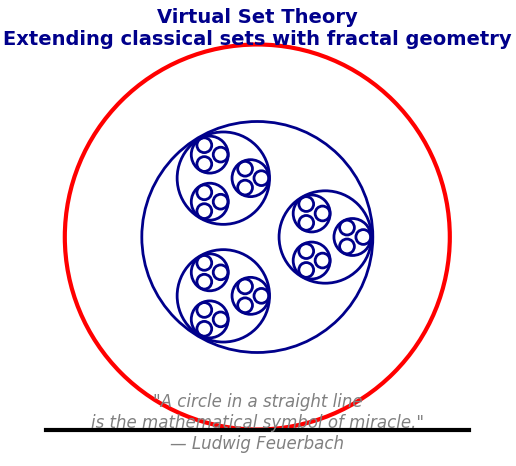

> "A circle in a straight line is the mathematical symbol of miracle."  
>  
> — Ludwig Feuerbach, *The Essence of Christianity*



Note: While readers may proceed directly to the three research articles and the statement and proof of the Generalized Problem of Apollonius in the section Enumerative Geometry: Counting Circles with Specified Constraints, I encourage a thorough reading of the entire manuscript. Metaphors employed throughout this text are intended primarily as notational conveniences to facilitate the expression of the core ideas underpinning Virtual Set Theory (VST) and the associated proofs presented in the referenced papers. These metaphors serve a structural, rather than figurative, role and are introduced solely to aid formal exposition

# Virtual Set Theory

Virtual Set Theory is a mathematical framework (not a mathematical foundation or alternative logical model it sits entirely within classical mathematics) that extends classical set theory by introducing a refined topological and homotopical notion of membership. This extension allows for fractal, recursive, and self-containing sets—concepts traditionally forbidden in classical Zermelo-Fraenkel set theory by the Axiom of Foundation.

---

## Motivation: Classical Limits and Modern Geometry

Classical set theory prohibits sets from containing themselves, preventing paradoxes such as Russell’s paradox. However, many modern mathematical phenomena in algebraic and enumerative geometry naturally exhibit recursive and fractal-like structures that classical theories struggle to model rigorously.

Virtual Set Theory is motivated by these phenomena and the solution of classical enumerative problems—most notably, the generalized Apollonius problem:

- The **generalized Apollonius problem** concerns finding circles tangent to specified collections of geometric objects (points, lines, circles).
- The moduli space of these tangent circles admits a natural **stratification** into loci describing tangencies, degenerations, and incidence conditions.
- Nested degenerations produce **infinite fractal-like strata**, which classical counting methods and topology cannot fully capture.
- Virtual Set Theory captures these infinite recursive degenerations by encoding *membership* as inclusions within these strata, leading to a **topological self-membership** interpretation of sets.


Why this problem? It is chosen to demonstrate intricate enumerative constraints and fractal degenerations in moduli space that simpler classical versions do not exhibit.
It is not the absolute minimal generalization, but a carefully crafted example that balances complexity and tractability for the theory’s purposes that can be solved on a computer in finite time.

---

## Core Ideas
- **Lines, circles, and points are the primal, intuitive building blocks of geometry**—just as points form the foundation of sets. In some sense, lines, circles and points are all the same gemetric objects (for example in inversive geometry) and they serve as the elemental constructs from which virtual sets are rigorously built, embodying the geometric essence underlying complex mathematical structures. The intuitive reason they are used instead of only "points" like in set theory is that they encode information (see paper2 on the formal encoding defined)
- **Stratified Moduli Spaces:** Parameter spaces of geometric configurations are decomposed into locally closed strata reflecting different singularity and tangency types.
- **Virtual Membership:** The classical binary membership relation is replaced by a continuous inclusion of points into fractal strata, allowing sets to *contain themselves* in a topological sense.
- **Virtual Fractal Sets:** Infinite descending intersections of strata capture recursive geometric degenerations, generalizing classical sets.
- **Resolution of Paradoxes:** Russell’s paradox is resolved as membership becomes topological and continuous, not discrete logical inclusion.
- **Compatibility:** Virtual Set Theory extends classical set theory without contradiction, building atop classical algebraic geometry, motivic homotopy, and derived geometry. Anywhere you see the term *set* in a proof you can almost always use *virtual set* and build the same objects but with more powerful properties.

---

# Enumerative Geometry: Counting Circles with Specified Constraints

## 🚩 Problem Statement

**Given:**

- Three distinct circles \( C_1, C_2, C_3 \),
- Two distinct points \( P_1, P_2 \),
- Five distinct lines \( L_1, \ldots, L_5 \),

all in general position in the plane.

**Goal:**  
Determine the number of distinct circles \( C \) such that:

1. \( C \) is tangent to **exactly two** of the three given circles,
2. \( C \) passes through **exactly one** of the two given points,
3. \( C \) is tangent to **exactly three** of the five given lines.

---

## 🧮 Approach: Enumerative Geometry via Algebraic Intersection Theory

We model this problem using ideas from **intersection theory** and **enumerative geometry**, specifically:

- Representing each geometric constraint as a **formal divisor class** \( h \),
- Encoding "exactly" constraints using **inclusion-exclusion**,
- Reducing polynomial expressions using a Chow ring relation:  
  \[
  h^3 = 2h
  \]
  which reflects the intersection theory of the moduli space of circles (dimension 2).

### Algebraic Encoding of Constraints

#### 1. Tangency to Exactly 2 of 3 Circles
Each tangency imposes 1 condition ⇒ class \( h \).  
So:
\[
\text{expr\_circles} = \binom{3}{2} h^2 - \binom{3}{3} h^3 = 3h^2 - h^3
\]

#### 2. Passing Through Exactly 1 of 2 Points
Each point imposes 1 condition ⇒ class \( h \).  
So:
\[
\text{expr\_points} = 2h - 2h^2
\]

#### 3. Tangency to Exactly 3 of 5 Lines
Each line tangency is 1 constraint ⇒ class \( h \). Use inclusion-exclusion:
\[
\text{expr\_lines} = \binom{5}{3} h^3 - \binom{5}{4} (2h^2) + \binom{5}{5} (2h^3)
\]

## 🧠 Computation

We compute the total number of solutions (circles) by multiplying the above constraints:
```
expr_total = expr_circles * expr_points * expr_lines
```

The theory is developed in detail on Paper #2 but this example  provides a way to understand the "size" of virtual sets, linking it to numbers and providing the basis for combinatorics. Sound familiar?


## Mathematical foundations of virtual sets (paper #1)

So how do you define a virtual set? How do you go from the previous problem to a definition of virtual set. The Apollonius problem lies at the intersection of classical constructions, analytic geometry, and algebraic geometry, serving as a fundamental example that unifies these diverse mathematical theories, so is not an arbitrary or trivial choice for VST. You can start here and read about the foundations of virtual sets in my first paper [here](https://github.com/EnumerativeGeometry/enumerativegeometry.github.io/blob/main/content/papers/paper1/paper1.pdf)

## Solution to the generalized Apollonius problem (paper #2)

After reading the foundations of virtual sets which define a continuous set membership using strata, you can read about the problem of Apollonius and the generalized solution here using the language of virtual set theory [here](https://github.com/EnumerativeGeometry/enumerativegeometry.github.io/blob/main/content/papers/paper2/paper2.pdf)

## Future research (paper #3)

You can read about future research on virtual sets here and the roadmap to redefine ZF with "virtual sets", anywhere set is used, replace set with virtual set [here](https://github.com/EnumerativeGeometry/enumerativegeometry.github.io/blob/main/content/papers/paper3/paper3.pdf)

This presents a roadmap for how virtual sets can not only extend but 'break the rules' by resoling several paradoxes and possibly open problem (although, *I do not claim to prove this at this point)*.

## Why This Matters

Virtual Set Theory (VST) equips mathematicians with tools to:

- Formally describe and analyze fractal-like, recursive, and degenerative geometric phenomena.
- Obtain motivic invariants and refined enumerative counts inaccessible to classical methods.
- Tackle longstanding open problems such as resolution of singularities in positive characteristic using stratified motivic frameworks.
- Expand the foundational language of mathematics while preserving classical logical consistency.

---
## Isn't VST just reinventing the wheel since category theory and other frameworks already exist?

VST is NOT a replacement for any foundations of math, instead, you can think of it as its own version of math built on top of classical mathematics, it is not a foundation but it is very expressive (you can replace set with virtual set almost anywhere in a proof).

While category theory and existing foundational systems provide elegant, abstract ways to relate mathematical objects, they fundamentally treat objects as black boxes and do not capture the internal, recursive, fractal nature of membership arising in modern geometric problems. Category theory excels by focusing on morphisms and universal properties, offering a "top-down" template that unifies structures across mathematics by how they relate externally, but it glosses over the stratified, infinite degenerations lurking inside sets themselves. Virtual Set Theory, in contrast, is a "bottom-up" theory emerging directly from geometric realities—stratified moduli spaces where classical set membership fails to describe infinite self-containing structures without paradox. Its novel continuous, homotopical notion of membership captures subtle recursive nuances invisible to category theory’s morphism-centric language, offering a rigorously consistent extension that models the true complexity of sets as they appear naturally within enumerative geometry. Moreover, unlike classical set theory which became more restrictive post-Russell paradox—limiting self-containing sets and fractal membership chains—Virtual Set Theory reopens this door in a controlled, geometrically motivated way, enriching foundational mathematics rather than repackaging existing abstractions.

## This is not possible as it breaks the rules of math

Another misconception. Virtual Set Theory does not break the fundamental rules of mathematics but extends classical set theory by redefining membership as a continuous, topological notion that naturally accommodates fractal, recursive, and self-containing sets without leading to logical contradictions. This approach is deeply inspired by enumerative geometry, where moduli spaces often exhibit intricate stratifications reflecting degenerations and recursive tangency conditions that form fractal-like patterns. Unlike classical set membership, which is a rigid, binary relation, the continuous inclusion in Virtual Set Theory can model infinite descending chains and self-membership analogously to fractals’ recursive self-similarity and non-integer dimensions. This connection to fractal geometry is not metaphorical but structural: just as fractals capture geometric complexity arising from iterative constructions and self-similarity, Virtual Set Theory captures the infinite recursion and intricate stratifications present in geometric enumerative problems, thus rigorously expanding the mathematical language to reflect these deeper geometric realities, consistent with modern frameworks like derived geometry and homotopy theory.

## What is Virtual Mathematics?

“Virtual Mathematics” is all theorems we can deduce from ZF axioms where 'set' is replaced with 'virtual set'. In this framework, many classical mathematical structures can be analogously reconstructed within classical math but with controlled singularities and fractal-like membership behaviors that classical foundations exclude. Unlike traditional axiomatic set theories that impose overly rigid restrictions—effectively ruling out objects exhibiting infinite recursive self-containment or complex degenerations—Virtual Set Theory imposes exactly the right balance of constraints to permit such phenomena consistently. This flexibility enables the formal existence of mathematical objects that classical theory deems impossible or paradoxical, akin to longstanding “impossible” problems like squaring the circle through equidecomposition but in a rigorously defined and geometrically meaningful context. By doing so, Virtual Mathematics promises a richer universe of structures capturing subtle recursive and singular behavior essential for modern geometry and topology, offering a foundational framework that truly reflects the complexity of mathematical reality rather than artificially denying it.

## Will you publish your papers on Arxiv?

No, I most certainly will NOT. All of my papers will be published on this Github only as I go through all of my favorite math papers and re-construct them using virtual mathematics.

Best Regards,
Quentin d'Aubigny
