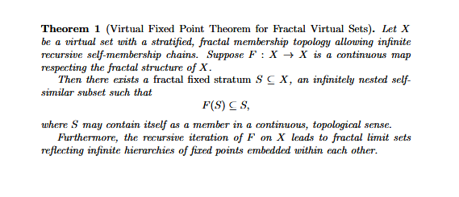
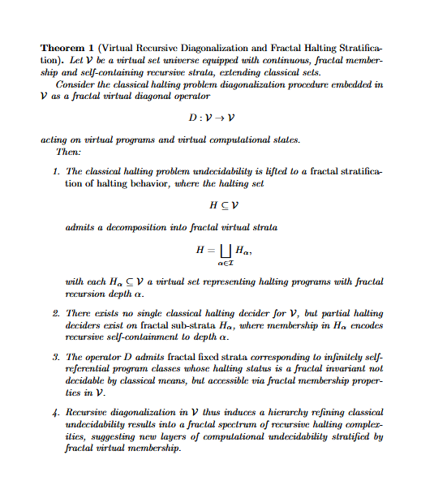
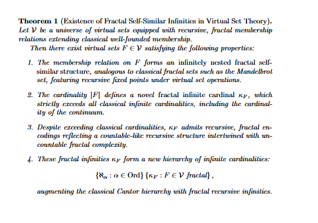

# Virtual Set Theory and Enumerative Geometry: The Generalized Apollonius Problem

> "A circle in a straight line is the mathematical symbol of miracle."  
>  
> — Ludwig Feuerbach, *The Essence of Christianity*

---

## Introduction and Motivation

Virtual Set Theory (VST) enhances classical set theory by redefining membership as a **continuous, recursive, and parameterized relation**, inspired by fractal-like degenerations in enumerative geometry.

The theory centers around the **generalized Apollonius problem**, which extends the classical question of finding circles tangent to given geometric objects. This problem exemplifies the complexity and fractal recursive nature of membership that classical set and foundational theories struggle to represent.

---

## Enumerative Counting Problem

**Given:**

- Three distinct circles \( C_1, C_2, C_3 \),
- Two distinct points \( P_1, P_2 \),
- Five distinct lines \( L_1, ..., L_5 \),

all in general position.

**Goal:** Count all circles \( C \) such that:

1. \( C \) is tangent to **exactly two** of the three circles,
2. \( C \) passes through **exactly one** of the two points,
3. \( C \) is tangent to **exactly three** of the five lines.

---

## The Moduli Space Framework

The moduli space \(\mathcal{M}\) parametrizes all points, lines, and circles uniformly:

\[
\mathcal{M} = \{(x,y,r) \mid (x,y) \in \mathbb{R}^2,\, r \in \mathbb{P}^1(\mathbb{R}) = \mathbb{R} \cup \{\infty\}\}
\]

where:
- \( r=0 \) corresponds to points,
- \( r \in (0,\infty) \) corresponds to circles,
- \( r = \infty \) corresponds to lines.

Points, lines, and circles coexist as elements in \(\mathcal{M}\), allowing degenerate cases and infinite limiting behavior. This space is the natural geometric arena for the enumerative constraints defining the problem.

---

## Classical Apollonius Problem

Given three fixed circles \( C_i = (x_i,y_i,r_i) \in \mathcal{M} \), find all circles tangent to each \( C_i \).

This amounts to solving:

\[
\begin{cases}
(x - x_1)^2 + (y - y_1)^2 = (r \pm r_1)^2 \\
(x - x_2)^2 + (y - y_2)^2 = (r \pm r_2)^2 \\
(x - x_3)^2 + (y - y_3)^2 = (r \pm r_3)^2,
\end{cases}
\]

where \( \pm \) is chosen for internal or external tangency.

---

## Virtual Set Theory: Parameterized Membership

VST replaces classical binary membership \( \in \) with a **parameterized virtual membership**:

\[
\widetilde{\in} : E \times \mathcal{I} \to \{0,1\},
\]

where:
- \( E \) is the universe of geometric elements (circles, lines, points),
- \( \mathcal{I} \) is an indexing parameter space (posets, trees, directed graphs) encoding recursive and fractal membership layers.

This membership can be conceptualized as a **bijection embedding mathematics within itself**, where every classical set can be replaced by a virtual set with richer recursive internal structure, including solutions to recursive paradoxes such as Russell’s paradox.

---

## Enumerative Solution: Intersection Theory in Virtual Context

Constraints correspond to formal divisor classes \( h \), with the Chow relation in the moduli space:

\[
h^3 = 2h.
\]

The problem’s constraints encode as:

\[
\begin{aligned}
\text{Tangency to exactly 2 of 3 circles} &: 3h^2 - h^3, \\
\text{Passes through exactly 1 of 2 points} &: 2h - 2h^2, \\
\text{Tangency to exactly 3 of 5 lines} &: \binom{5}{3} h^3 - \binom{5}{4} 2h^2 + \binom{5}{5} 2h^3 = 10 h^3 - 10(2h^2) + 2 h^3 = 12h^3 - 20 h^2.
\end{aligned}
\]

Multiply and reduce:

\[
\text{Total count} = (3h^2 - h^3)(2h - 2h^2)(12 h^3 - 20 h^2),
\]

applying \( h^3 = 2 h \) to compute the exact enumerative number of such circles.

---

## Why This Matters and Responding to Criticisms

- **Generality:** Unlike classical set theory or category theory, VST models the **internal recursive, fractal hierarchical membership** made explicit through parameterized relations, capturing natural enumerative co-dependencies unreachable by classical foundations.

- **Novelty:** VST is not a replacement for existing frameworks but a **math-embedded-within-math language** allowing the fundamental operation "set membership" to admit fractal recursion and controlled paradox, expanding what mathematical objects can be treated rigorously.

- **Foundational strength:** The classical paradoxes such as Russell's paradox become **true and noncontradictory** within VST, enabling the revisit and reinforcement of mathematical results with this richer structure.

- **Practical impact:** VST improves enumerative geometry by allowing computations and constructions involving counting objects in stratified moduli spaces with fractal degenerations, paving the way for future breakthroughs in algebraic geometry and topology.

---

## Foundational Papers and Further Reading

- Foundations of Virtual Sets: [Paper #1](https://github.com/EnumerativeGeometry/enumerativegeometry.github.io/blob/main/content/papers/paper1/paper1.pdf)  
- Apollonius Problem Resolution in VST: [Paper #2](https://github.com/EnumerativeGeometry/enumerativegeometry.github.io/blob/main/content/papers/paper2/paper2.pdf)  
- Future Research and Extending ZF with Virtual Sets: [Paper #3](https://github.com/EnumerativeGeometry/enumerativegeometry.github.io/blob/main/content/papers/paper3/paper3.pdf)  
- Enumerative Geometry Overview: [Wikipedia](https://en.wikipedia.org/wiki/Enumerative_geometry)  
- Original Apollonius Problem: [Wikipedia](https://en.wikipedia.org/wiki/Problem_of_Apollonius)  
- Recent Algebraic Geometry Research: [McKean 2022](https://arxiv.org/pdf/2210.13288.pdf)  

---

## Visuals: Theorems Derived from VST (Illustrative)

  
_Description: Virtual fixed point theorem extending classical results._  

  
_Description: Virtual generalization of classical combinatorial identities._  

  
_Description: Recursive structure theorem analog to classical set theory results._

---

## Disclaimer on Publications

All work is **published on GitHub only**, allowing dynamic updates and iterative improvements, intentionally avoiding arXiv or journal publication to enable rapid theoretical progression and open community interaction.

---

## Contact and Contributions

Please share feedback, issues, or contributions via GitHub. Collaboration is warmly welcomed to explore and extend virtual mathematics.

---

*Best regards,*  
Quentin d'Aubigny

---
